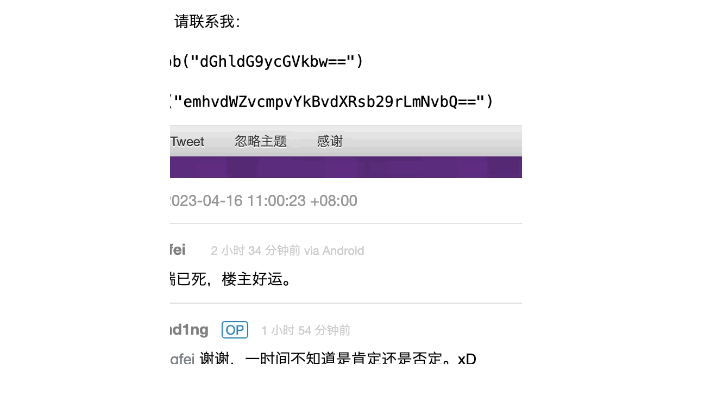

# Decode base64

为了方便解码 v2ex 上面的文本，用 chatgpt 写了这个插件

建议使用 [v2ex-polish](https://github.com/coolpace/V2EX_Polish.git)




## Setup

```
npm install
```

## Import as Visual Studio Code project

...

## Build

```
npm run build
```

## Build in watch mode

### terminal

```
npm run watch
```

### Visual Studio Code

Run watch mode.

type `Ctrl + Shift + B`

## Load extension to chrome

Load `dist` directory

## Test
`npx jest` or `npm run test`
